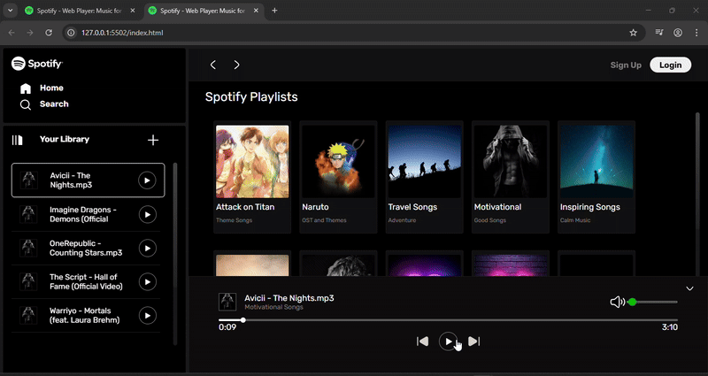
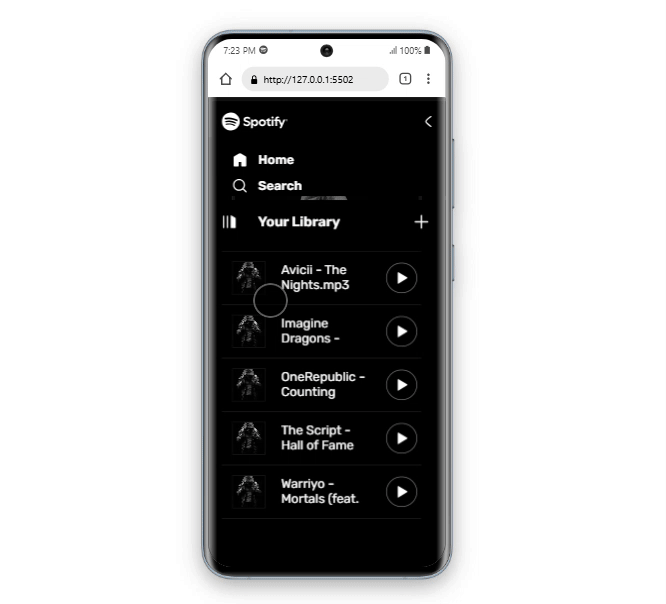

# 🎵 Spotify Clone

A **fully responsive** music player web app built using **HTML, CSS, and JavaScript**, featuring dynamic album loading and essential playback controls.


---

## 🚀 Features  
✅ **Play, Pause, Next, Previous** – Full music playback control  
✅ **Volume & Seek Controls** – Adjust volume and skip through songs  
✅ **Dynamic Album Loading** – Automatically loads album data  
✅ **Fully Responsive** – Works seamlessly across all devices  
✅ **Modern UI** – Inspired by Spotify’s sleek design  

---

## 🛠️ Tech Stack  
- **Frontend:** HTML, CSS, JavaScript  
- **Responsive Design:** Media Queries, Flexbox, Grid  

---

## 🎥 Live Demo  

### 1️⃣ Responsiveness  
  

### 2️⃣ Next & Previous Buttons  
  

### 3️⃣ Play, Pause & Volume Controls  
  

### 4️⃣ Hamburger Menu & Seek Functionality  
  


## 🌍 Hosted App  
🔗 **Live App:** [Click Here to Open](https://67e01d08b62b6de1a1209b44--polite-yeot-4e33a5.netlify.app/) 

## 📦 Installation & Setup  
1. **Clone the repository**  
   ```sh
   git clone https://github.com/RohanWagh-12053/Spotify-Clone.git
   ```

2. **Navigate to the project folder**

   ```sh
    cd Spotify-Clone 
   ```
3. Open **index.html** in a browser.


## 💡 Future Improvements

    🔑 User Authentication – Allow users to log in and save preferences

    🔍 Search Functionality – Enable searching for songs, albums, and artists

    🎨 Enhanced Animations – Smooth transitions for a better user experience

    🎵 User-Created Playlists – Allow users to create and manage their own playlists   

## 📜 License
This project is for educational purposes only.
